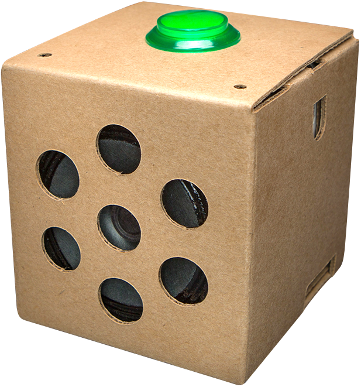

# AI4S Embedded: Audio Event Recognition on Edge Devices

Embedded general purpose, real-time sound recognition demo:



Welcome to our project's GitHub repository! Our work focuses on exploring the potential of audio event recognition using convolutional neural networks on edge devices, like Raspberry Pi, aiming to achieve real-time audio analysis and classification.

The prediction is obtained by applying the audio tagging system on consecutive short audio segments. It is able to perform multiple updates per second on a moderate CPU.

**This is a newer version. The original version can be found at [this branch](https://github.com/yinkalario/General-Purpose-Sound-Recognition-Demo)**

# Authors

This software is based on the AI4S demo created as part of the AI4S project at the University of Surrey. If you use our work, please consider citing us:

[1] Gabriel Bibbó, Arshdeep Singh, Mark D. Plumbley. "Audio Tagging on an Embedded Hardware Platform" arXiv preprint arXiv:2306.09106 (2023).

Paper: https://arxiv.org/abs/2306.09106

## Installation

**Step 1:** Install the Google AIY Voice Kit image on your Raspberry Pi. This image already contains everything needed to control the button and speaker of the kit. You can find the installation instructions on the [Google AIY Voice Kit official page](https://aiyprojects.withgoogle.com/voice/).

**Note:** Please ensure that you have the Google AIY Voice Kit properly set up before proceeding to the next step.

**Step 2:** Install the libraries required by our software. Due to hardware constraints, it is not possible to create a virtual environment using Anaconda on Raspberry Pi. Also, the available miniforge option does not allow peripheral control. Hence, you will need to install everything directly on your Raspberry Pi, without using virtual environments.

Please execute the following commands to install the necessary libraries:

```bash
pip install -r requirements.txt
```
Please ensure that all the libraries are successfully installed before proceeding.
```bash
git clone https://github.com/gbibbo/ai4s-embedded
```

### pretrained model (CNN9, ~150MB):

Download the model into your preferred `<model_location>` via:

```
wget https://zenodo.org/record/3576599/files/Cnn9_GMP_64x64_300000_iterations_mAP%3D0.37.pth?download=1
```

Then specify the path when running the app using the `MODEL_PATH` flag (see sample command below).

More models can be found [here](https://zenodo.org/record/3576599) and [here](https://zenodo.org/record/3987831).


# RUN

Assuming our command line is on `<repo_root>`, the `panns` environment is active and the model has been downloaded into `<repo_root>`, the following command should run the GUI with default parameters (tested on Ubuntu20.04):


```
python -m sed_demo MODEL_PATH='Cnn9_GMP_64x64_300000_iterations_mAP=0.37.pth?download=1'
```

Note that the terminal will print all available parameters and their values upon start. The syntax to alter them is the same as with `MODEL_PATH`, e.g. to change the number of classes displayed to 10, add `TOP_K=10`.


---

# Related links:

* https://research.google.com/audioset/dataset
* https://github.com/qiuqiangkong/audioset_tagging_cnn
* https://github.com/qiuqiangkong/panns_inference
* https://github.com/yinkalario/Sound-Event-Detection-AudioSet

Now you are ready to use our software on your Raspberry Pi. Enjoy!


