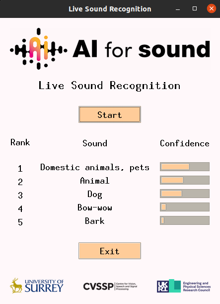

# Edge Device Audio Event Recognition

Welcome to our project's GitHub repository! Our work focuses on exploring the potential of audio event recognition using convolutional neural networks on edge devices, like Raspberry Pi, aiming to achieve real-time audio analysis and classification.

## Audio Files
We're excited to announce that we're sharing our experimental audio files used in this project. These files, recorded at various volume levels, were critical in assessing the performance of our model. You can find these audio files right here in the repository, ready for you to download, explore and perhaps even use in your own projects.

## Coming Soon: Code Scripts
To truly facilitate open and reproducible research, we're working on preparing the scripts used in our project. These detailed scripts will provide an in-depth look into our methodology and allow you to replicate, modify or even extend our work. Expect to see these scripts uploaded here soon!

## Contact Us
We appreciate your interest in our project and are always open to questions, comments or suggestions. For further details, please visit [AI4S](https://ai4s.surrey.ac.uk/). Stay tuned for more updates!


# ai4s_sed_demo

General purpose, real-time sound recognition demo:




The prediction is obtained by applying the audio tagging system on consecutive short audio segments. It is able to perform multiple updates per second on a moderate CPU. A sample video can be viewed at:

https://www.youtube.com/watch?v=7TEtDMzdLeY


**This is a newer version. The original version can be found at [this branch](https://github.com/yinkalario/General-Purpose-Sound-Recognition-Demo/tree/demo2019)**

# Authors

This demo has been developed and trained during our previous AudioSet work, check the following links for more info and models:

* Paper: https://arxiv.org/abs/1912.10211
* Repository: https://github.com/qiuqiangkong/audioset_tagging_cnn

If you use our work, please consider citing us:

[1] Qiuqiang Kong, Yin Cao, Turab Iqbal, Yuxuan Wang, Wenwu Wang, Mark D. Plumbley. "PANNs: Large-Scale Pretrained Audio Neural Networks for Audio Pattern Recognition." arXiv preprint arXiv:1912.10211 (2019).

Yin Cao, Qiuqiang Kong, Andres Fernandez, Christian Kroos, Turab Iqbal, Wenwu Wang, Mark Plumbley


---

# Installation

### Repo:

At the moment, no `pip` installation is available. Clone this repo into `<repo_root>` via:

```
https://github.com/yinkalario/General-Purpose-Sound-Recognition-Demo
```

### Software dependencies:

We recommend using Anaconda to install the dependencies as follows:

```
conda create -n panns python=3.7
conda activate panns
pip install -r requirements.txt
conda install -c anaconda pyaudio
```

A comprehensive list of working dependencies can be found in the [full_dependencies.txt](assets/full_dependencies.txt) file.

### pretrained model (CNN9, ~150MB):

Download the model into your preferred `<model_location>` via:

```
wget https://zenodo.org/record/3576599/files/Cnn9_GMP_64x64_300000_iterations_mAP%3D0.37.pth?download=1
```

Then specify the path when running the app using the `MODEL_PATH` flag (see sample command below).

More models can be found [here](https://zenodo.org/record/3576599) and [here](https://zenodo.org/record/3987831).


# RUN

Assuming our command line is on `<repo_root>`, the `panns` environment is active and the model has been downloaded into `<repo_root>`, the following command should run the GUI with default parameters (tested on Ubuntu20.04):


```
python -m sed_demo MODEL_PATH='Cnn9_GMP_64x64_300000_iterations_mAP=0.37.pth?download=1'
```

Note that the terminal will print all available parameters and their values upon start. The syntax to alter them is the same as with `MODEL_PATH`, e.g. to change the number of classes displayed to 10, add `TOP_K=10`.


---

# Related links:

* https://research.google.com/audioset/dataset
* https://github.com/qiuqiangkong/audioset_tagging_cnn
* https://github.com/qiuqiangkong/panns_inference
* https://github.com/yinkalario/Sound-Event-Detection-AudioSet


